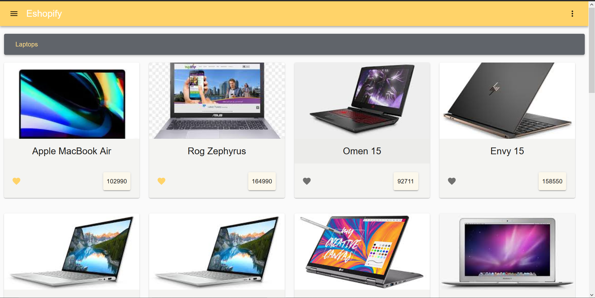
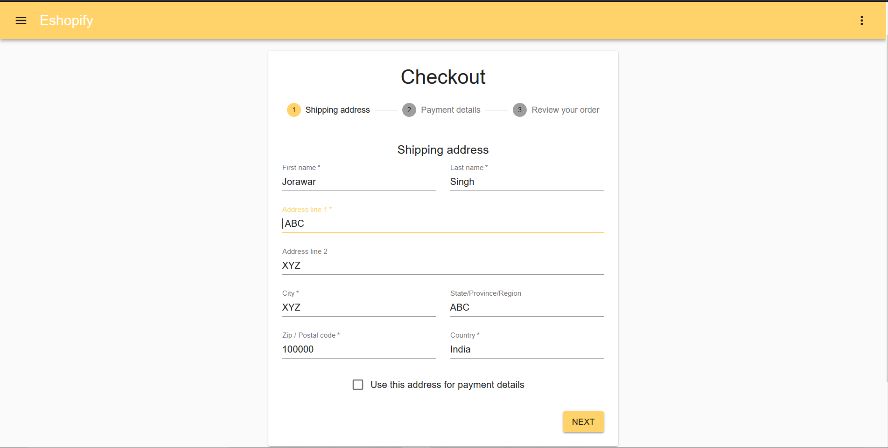
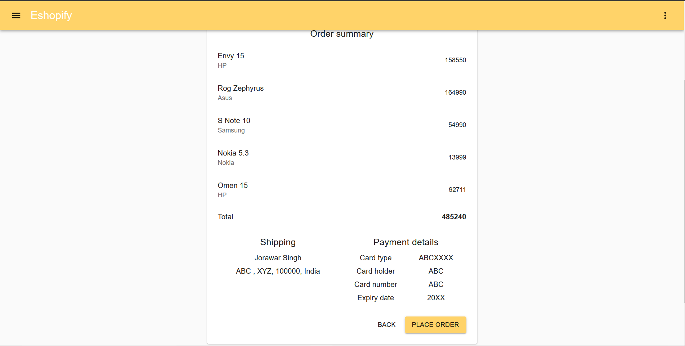
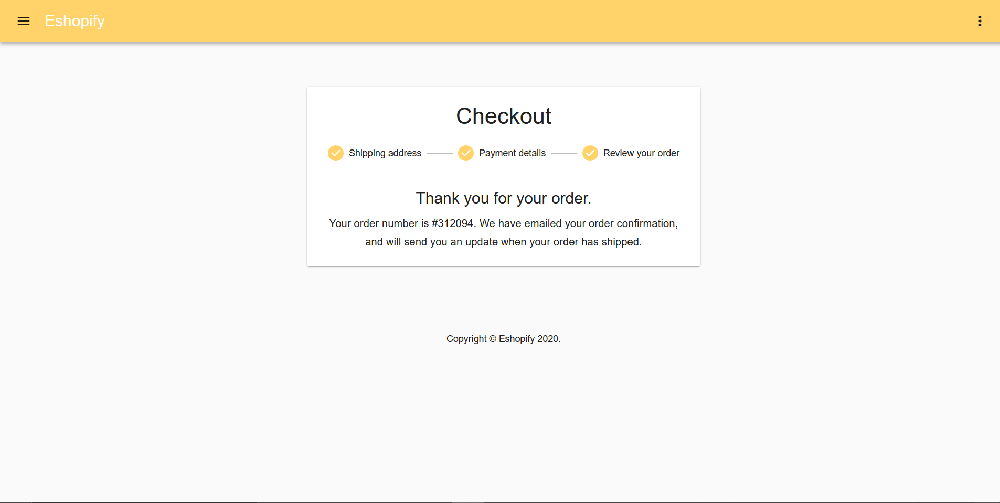
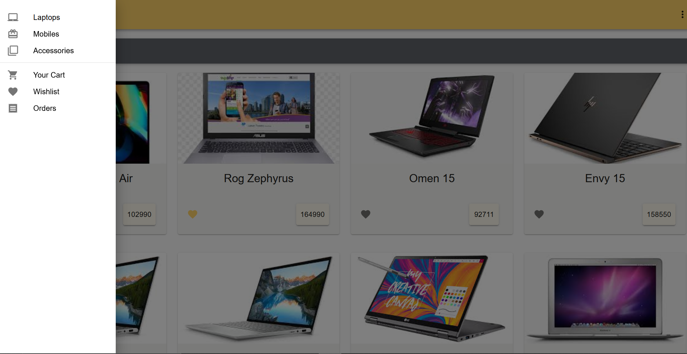
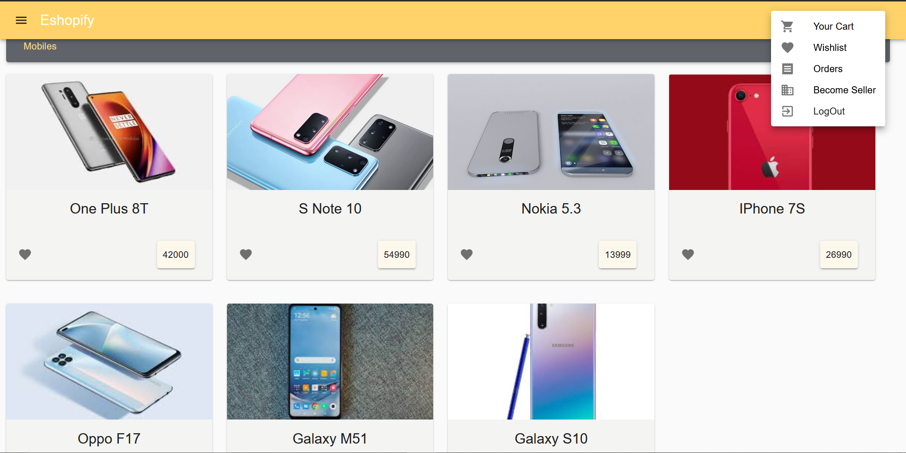

## Eshopify

This project (version 1) is live at : https://jorawarsinghsaini.github.io/Eshopify/

### Main Home Page

### Checkout Page

### Order Summary

### Card and Shipping Details

### Order Placement Completed Page

### Side Bar for easy access

### Various Options when logged In

* This is an e-commerce website built with React and Google Firebase Technologies.
* Cloud Storage is used to store images of different products.
* Google Authentication is used for authentication purpose.
* Cloud Store is used to store all the products on the cloud.
* UI is developed with the help of Material UI.
* Laptops and mobile phones can be purchased at with ease.
* The product currently shown are for demonstration purposes.

Goals for next commit :
1. Mail when order placement completed
2. Complete Product Description Page
3. Shareable Button on product description
4. Quantity option in card component
5. Zoomable Images in product description
6. Search option for easily searching a product

Project Developer - Jorawar Singh
